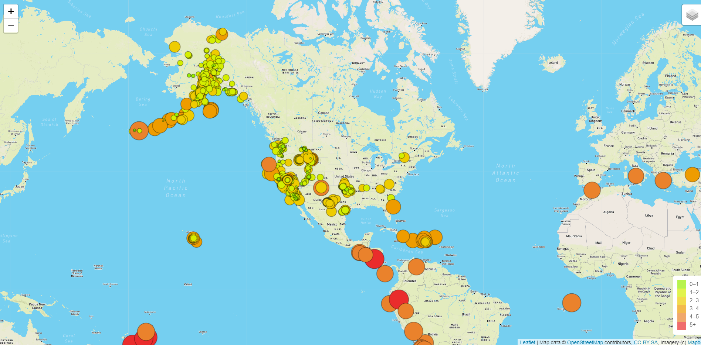
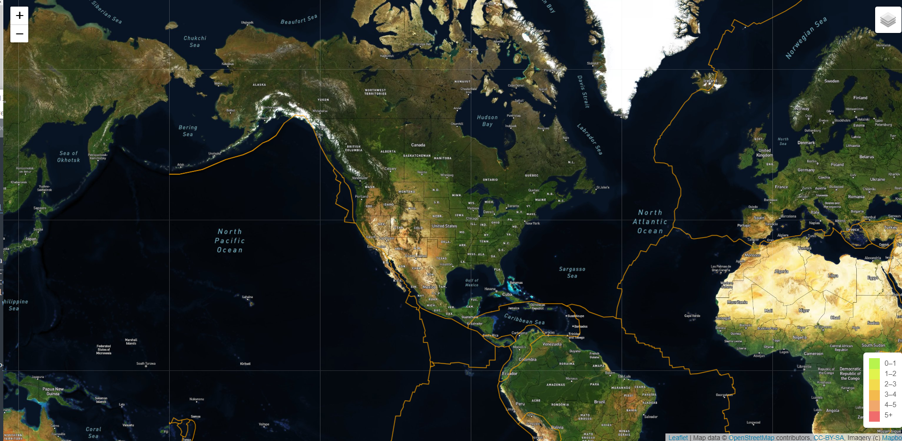
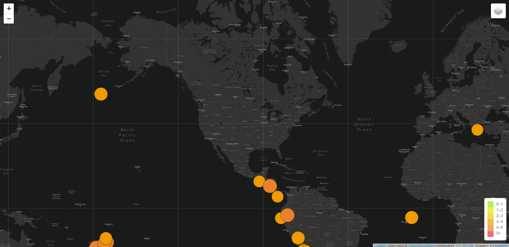

# Mapping_Earthquakes
Module 13  

## Overview of Analysis:

After finishing an earthquake map containing 2 different maps and an earthquake overlay for Basil and Sadhana, we have been tasked to add more options.  We will be adding another map and 2 overlays.  The new overlays will contain the tectonic plates and the earthquakes with a magnitude of greater than 4.5.

## Resources:

Software: 
Jupyter Notebook, Anaconda 4.10.1, Python 3.7.6, Visual Studio Code 1.56.0
 
Code:  	
[index.html](Earthquake_Challenge/index.html)  
[style.css](Earthquake_Challenge/static/css/style.css)  
[challenge_logic.js](Earthquake_Challenge/static/js/challenge_logic.js)  
		

Images: 
[images](Earthquake_Challenge/static/images)  	

## Visuals:

Streets View with Earthquake Overlay
  

Satellite View with Tectonic Plate Overlay
  

Dark View with Major Earthquakes Overlay
  

## Summary:

We have 3 different maps: Streets: Satellite, and Dark.

We have 3 overlays: Earthquakes, Tectonic Plates, and Major Earthquakes.